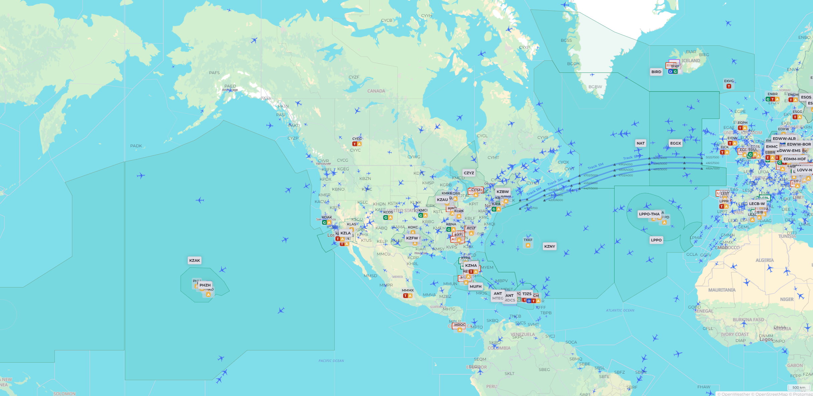

*封面来自：[FSnews](https://fsnews.eu/vatsim-cross-the-pond-eastbound-2025-canceled)*

# Cross The Pond

## Pond

Pond, 在非正式环境下可被译为“**较大水体**”，连起来就是**横跨北大西洋**。

当然，你可以将 Pond 译为“池塘”。**飞池塘**，这样的译名给活动增加一点戏剧性，也是我认为不错的译名。

无论如何它叫什么，本文将就此展开介绍。

## 简介

“跨越大西洋是一年举办两次的活动，涵盖大西洋两岸的分部，提供从出发到目的地的完整空中交通服务。” - [《VATSIM Cross The Pond》](https://ctp.vatsim.net)

大西洋一直都是神秘的，在VATSIM中，由于大西洋的各种规则，很多人不能接触到这篇神奇的空域，而CTP活动的开启和宣发，无疑将这些知识带给了大家。一次CTP活动有大约1000个飞行员、200个管制员、50条路线、12h的空域覆盖。

## Bookings

在参加活动前，为了满足大西洋空域的时间间隔要求，及空域分配有限。CTP团队建立了Bookings系统，可以在：[bookings](https://ctp.vatsim.net/bookings)，页面依据自己的需求进行时间预定。

## 基础知识

像是一些如：SELCAL、CPDLC、洋区放行的内容等等。均已在：[《如何在洋区飞行》](../flight-in-oceanic-area/)一文中作出介绍，这里就不再赘述了。

## 网络简报会议



由于1个小时的视频内容太长了，我并没有选择看该内容。

## Discord

CTP的Discord内，会带来活动最新进展，详情可查阅：[Discord](https://ctp.vatsim.net/discord)，并加入DC群组。

# 结言

最后，无论你是小白还是大佬，希望飞的愉快！

哦对了！祝愿飞的时候游戏不崩溃！