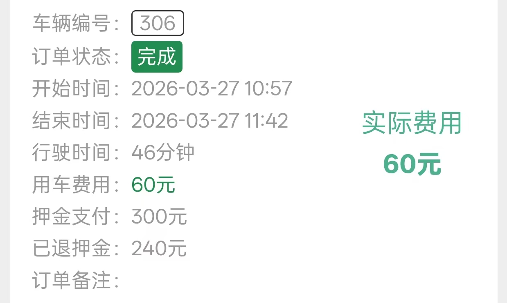

2026年3月27日，我校终于迎来了我们的春游，美其名曰：“探究性学习活动”。昨晚，我在Xflysim飞了一班 `ZUUU-ZULS` ，还是意犹未尽，接着就踏上了征途。

清晨，蒙蒙的细雨裹着昨日泥土的芳香，一滴滴雨水从天空中飘下。这毛毛细雨中，有的人打着伞，有的人披着雨披，有的人打伞了，这不禁让我想起来：

早餐，依旧是非常好吃的麦当劳啊，一个帕尼尼加上**热美式**，记住，接下来要考。

吃完，发现已是 `07:55`，立马拎着没喝完的美式，跑进班级里面，摆在了桌子上。然而，我突然想起来了一个同学的梗，暂且按下不表，然后我的桌子被轻微踹了一下，咖啡撒了1/3，撒在了地上。

那么，这个梗是什么呢？让我们回到那节语文课，当时的我正在写作文，我旁边的同学仿写了鲁迅的著名文章写到：“我的家门口有一个消防栓，最普通的消防栓，红色的消防栓······”随后，又有更多的人得知了这个令人喜悦的消息。至此，已成为历史。

随后，他将餐巾纸抽了几张递给我，让我擦拭地上的、桌子上的咖啡。前期准备算是完成了。接下来让我们快进到坐车的时候，我们的某位同学，被前后左右100斤的大胖子挤死了，为什么我会知道呢，因为在后面的聊天中反复提及。

下了车，我们先参观的“淞沪会战纪念馆”，里面的每一个场景，记忆犹新，体现出了中国军人的英勇作战，只不过，这个场馆比较小，我们大概参观了15分钟就出来了。其他时间，花费在进馆的分流和排队上。

接下来，我们到达了“吴淞炮台湾湿地森林公园”，也是我小时候非常喜欢抓螃蟹的地方。可惜，物是人非，那里已不让人抓了。我们先到达了儿童游乐园，领取游乐票。但，都是一些小儿科的东西，我就没有玩下去的兴致了，看到远处有双人自行车，我便和几位同学一起，租了2辆车，开启了车王之旅。以前没有觉得很好玩，现在觉得这个公园只有这个好玩。

骑了一圈下来，我的腿都麻了，由于不可抗力因素，只骑了46分钟就早早还回了。

再接着，我用`Nikon D3100`拍摄了一些照片，下面请欣赏。

 

 

下面，让我们欣赏某位神人制作的鬼畜视频啊，也是非常的好看！



让我们下周再见吧！👋👋👋