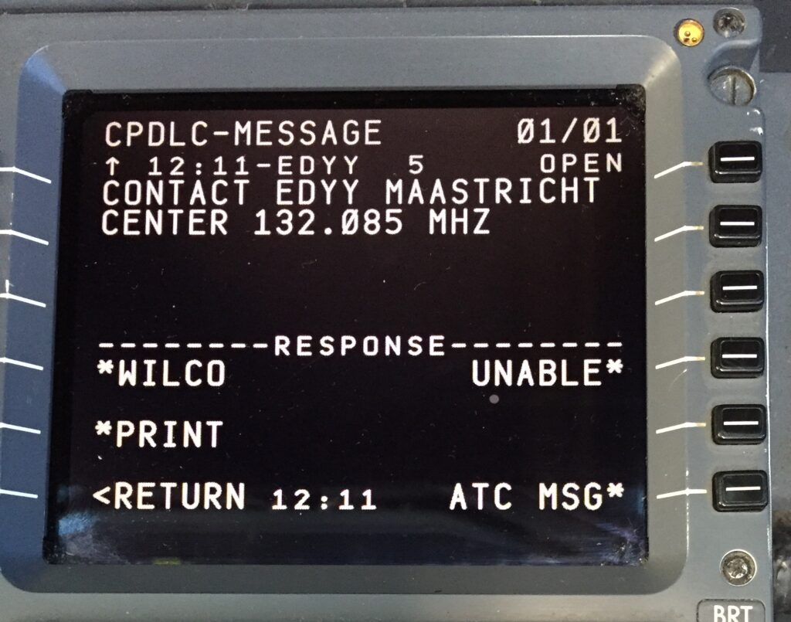
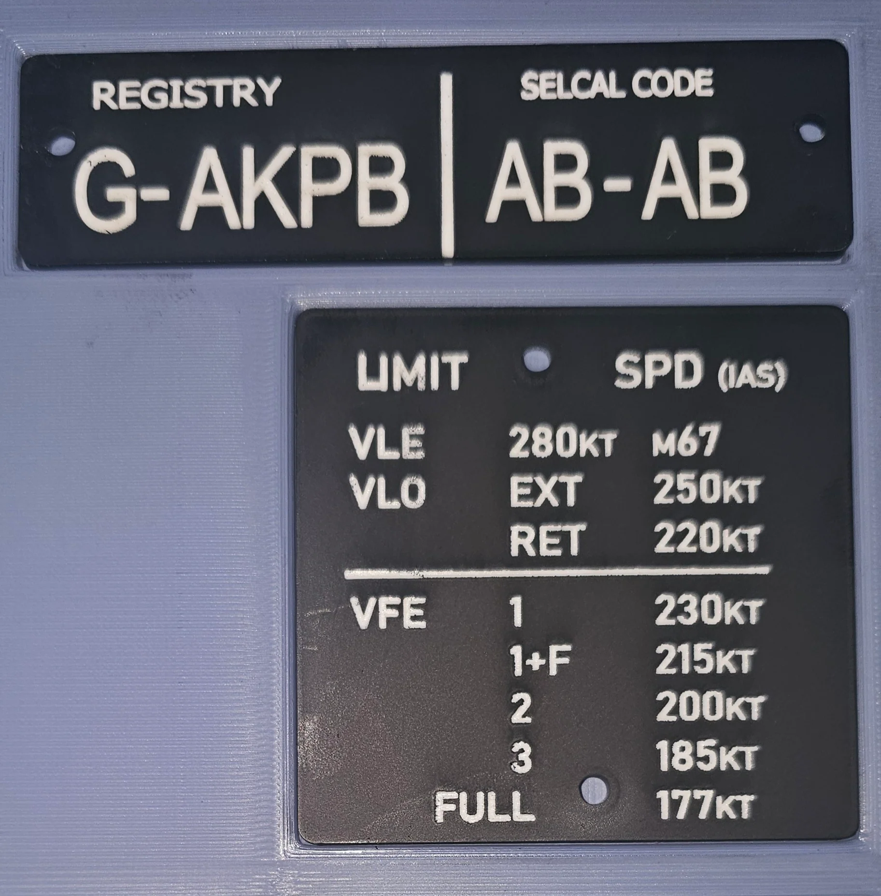
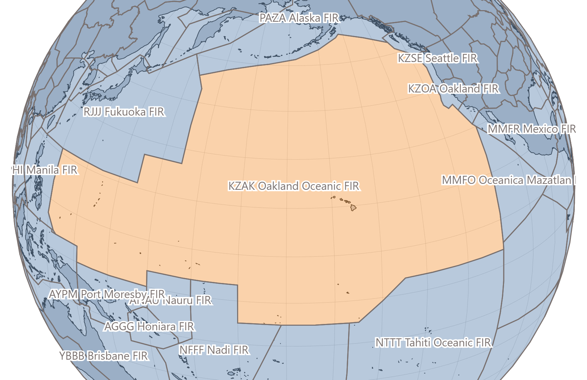
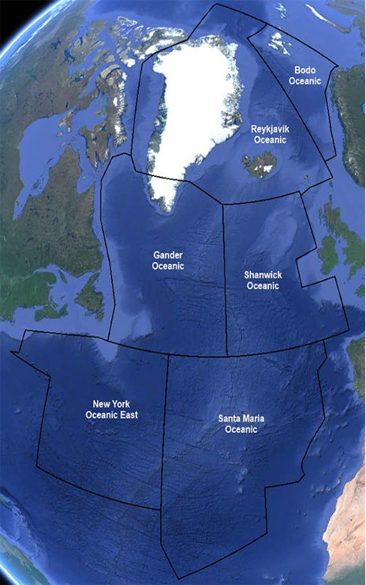

# 前言

世界上大部分的洋区都与北大西洋（NAT）、太平洋（ZAK）洋区的运行模式类似，本文就以这两个为示例演示最基础的洋区飞行教程

在VATSIM中，每年4月份举办的`Cross The Pond`吸引了无数的飞友前往，在此之前，每一位飞行员有必要了解洋区的运行逻辑和如何飞行，避免第一次就飞过去，造成混乱。本文将主要泛泛而谈，部分内容不具体展开。

## 基础知识

这些知识是在飞之前必须要做一个了解的。

### 无线电管理机构

在洋区飞行中，为了防止管制员负担压力过大和无线电传输距离有限，在洋区中，飞行运用的并不是在大陆地区的VHF，而是飞机上的HF。

而HF呢，经常会出现问题，比如：叫不到机组。总不可能让管制员一边处理管制指令，一边调整无线电天线吧？于是，ARINC短波无线电管理机构出现了。

机构主要的目的是通过与管制员的沟通，达到二次传输管制员指令和辅助的作用，也就是将管制员的指令用语音告诉机组。

在此，另外插入一句：由于，VATSIM的无线电模拟无法做到确切的HF，会导致软件更加混乱。因此，我们在地图（VATSIM-RADAR）上面看到的管制员频率，是经过处理的VHF，飞机可以直接调频。

### CPDLC

CPDLC，具体的原理不再此进一步介绍，类似于管制员给你发文字指令，只不过现实中没有XPilot，通过CPDLC将信息发到飞机的MCDU上面，飞行员进行确认和回复，飞行员也可以申请：高度、速度。

在使用CPDLC和管制员建立通信后，机组可以将HF频率的耳机声音关掉，等待管制员发来SELCAL呼叫回语音或继续查收CPDLC消息。

### SELCAL

为了让机组可以不一直收听无线电管理机构，诞生了CPDLC。然而，CPDLC仍有延迟，无法做到像HF那样的及时性。于是，SELCAL出现了，这个工具可以让管制员（无线电管理席位）在通话之前通过SELCAL发送提示音，飞机会有：“嘟 ~ 嘟 ~ ”的一声，机组就知道管制员将要叫他们了。

### 位置汇报

POSTION REPORT，通过上述语音和CPDLC自动化的方式，让管制员能够估算出机组的大概位置，这个位置是不准确的，经常需要校准。因此，CPDLC的自动汇报位置就起作用了，它会自动帮机组完成这个工作。

## 太平洋（ZAK）

其实叫太平洋是不怎么准确的，ZAK_FSS，主要管辖的是Oakland区调洋上范围，有两部分大机构组成：Oakland ATC、ARINC短波无线电管理机构。

该席位的无线电呼号是：“San Francisco Radio”，VATSIM创新性的将无线电管理席位和管制员席位合二为一，因为，模拟飞行的管制员不需要处理故障和其他情况。

在进入ZAK洋区前，你不需要做出任何的操作，没有错，连位置汇报、洋区放行都不需要主动操作，你只需要飞到空域，联系管制员就可以了。前序管制员在线的情况下，他们会帮你进行处理。

## 北大西洋（NAT）

北大西洋相较于太平洋，有更多的信息被彰显出来，目前可知的是：该地区在逐步使用ADS-B管制，此举可以进一步缩短间隔。

NAT洋区是不支持CPDLC申请洋区放行的，现在的洋区放行需要在nattrak网站上进行申请（强烈不推荐语音放行），**也可不经申请，直接由管制
员发送。**

这个步骤是必须的，无论前序管制员是否在线，任何机组在洋区内飞行必须区得洋区许可。

## 视频及资料





