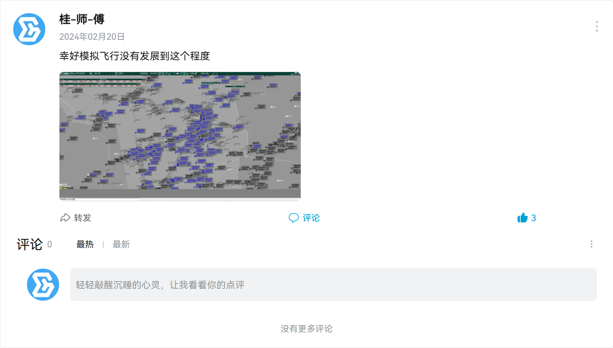

最近，感觉自己的生活过于“充实”，每天眼睛一闭，眼睛一睁就是写代码、上管、打游戏。感觉这样的人生毫无意义。我也觉得这样的人生没有意义，“游戏只是一种娱乐的方式，我劝你还是以学业为重”这是一位我的老友曾对我劝说这的。再加上，我在Sino论坛翻翻找找模拟机文本，无意间看到了Yuchen Qian写的短文，我也就回望回望我这“游戏人生”吧。

此文章经过和谐处理，对个人的呼号仅提示，未进行任何点名批评或者指责的意思，也没有必要事情都过去这么久了。

大概是小学五年级后半学期的时候。想到当初是疫情的契机，我先是在B站上认识了一位Up主，每天上完课就是和一群人Minecraft ~~说是打游戏实际上就是瞎闹~~ 。当时也确实蛮无聊的，什么像：和平精英、PUBG地铁等，之类的游戏都玩腻了。属实没事情干，再加上最近抖音上热传什么“青少年模拟飞行竞标赛是白名单、参与了非常有用的”在这种的言论下，我下载了严格意义上的第一款模拟飞行“Aerofly FS Moblie”为什么是Moblie呢？因为Moblie免费。其实在那个时候我已经有Steam了，甚至老早就有了自己的电脑用来打MC，甚至偶尔会写一点Python的代码（实则也是胡搞），我就在Steam上面搜模拟飞行，不通，搜Flight Simlator，总算有点像样的了，但是看预览图属实不咋他，后来在B站搜了搜，就下来“Aerofly FS Moblie”。再后来的转变就是偶尔看到了一个破解网站，上面有破解版本的电脑版“Aerofly FS”，也就正式开启了电脑的模拟飞行生涯，我仍然深刻的记住当时用百度网盘下来一整夜电脑转的痛苦。再后来我接触到了“X-plane”奈何当时的老爷机带不动（3代i5），只好作罢，还是回到了我的游戏。

后来呢，也不知是不是我大概是我初中预备年级的时候（上海这里六年级划归初中管），我终于拥有了属于自己的电脑，当初啥也不懂买了个轻薄本（4000多血亏），但是想着也算有自己的电脑了，于是就开始飞了“X-plane”，记得很清楚，是B站一位叫“大大大白蚁”（现在叫“大白蚁同学”）的Up主，他的B站视频所引导我安装破解版本，飞飞机的。最初还是JD的A320，奈何不知道XP没升级不能下Toliss破解的机模，只好飞飞Zibo的B738，说来当时也傻，觉得B738这个代号估计是最不严谨的说法，也一直说B737-800。再后来单人飞腻了，开始加入DFA这个模拟飞行平台飞了，也认识了一群有兴趣的伙伴，像是：1017、2921、2022、9105、3718等等，虽然现在的大家都基本不混在自己创办的平台里面了。我觉得当时也蛮有意思的，一群小屁孩莫名其妙的创办了1个虚拟航司+1个平台。我也从一个小小的傻白甜，混到了能教别人ES的水平。

在后来，我七进七出平台，难得回归了自己的真实生活，说起来了也怪，当时我一边打一些机器人竞赛，一边搞学习，一边还搞在和模拟飞行的那帮人搞。但是呢，样样都搞得不怎么差。最后，我落得了从SUP被逐出平台的境地，我在这里说这段故事不是为了向别人抱怨，只是单纯的补齐这段经历。我尽力了前所未有的失落，一整晚，我所追求的事业什么都没有了。我也曾经尝试过求和，但碍于自己的脸面始终放不下去。也行，我对模拟飞行所有褒义的幻想从这里就结束了。

我始终没有勇气来面对接下来的琐事，又回到了疫情期间的那种状态，不过，从班级的同学换成了网上结交的飞友。我也是在这个时候第一次接触了这款叫《CS：GO》的游戏。当时，也是处于瞎玩的阶段，完全不知道应该怎么打，在这里我还是要感谢2022和9105这两个人，虽然曾经也对喷过，但是当时是真的快乐。快乐也始终有一天有尽头，我不知又是什么心态，和认识的另一批人，开了个虚航。没想到的是，最终还是倒闭了。。。我也反思过为什么？只觉得是我们运营能力不行，飞到后面机组越飞越少，服务器钱都不够续了。

记得是在一次凌晨，我加了B站一个叫什么什么ID的人（现在也记不起来了），也就是1038先生，其实我觉得他心也蛮大的，可以通过B站这种方法结交朋友的，不过也没什么了。我通过他发过来的一些文件，逐渐了解到了ES的插件这个巨大生态，我当初不知道从哪里搞来了个TopSky，然后就激动的像个小孩子一样在那边拍教程视频。我觉得这是一件伟大的事情，我从小就在那边看各种类型的游戏实况主，也希望自己有朝一日能够成为，但是这是不可能的。无论如何，我是彻底搭上扇区的潘多拉魔盒了。后来的事情嘛？想必大家都尽力过，扇区停在了2313，每一个会意识到这是一个灭顶的灾难，我也是。当时还在那边和朋友吹着牛皮“扇区后面总会有人搞出来的”，我也从来没有想到过这个是我。再后来，我和1038就正式开启了做扇之门，想当初还是用QQ作为我们的传输工具的。我只有当初在机场（上海浦东机场的卫星图那里，估计是去什么地方打机器人比赛），一边改ZYSH.prf TopSky加载不出来的bug，另一边反手打开了扇区，截了这样的一张图和发了动态。

这个的当时Github上面，我找了老半天的一个可以投影天上飞机的FSD，我现在也找不到这个项目了，只有一个B站视频记录着。

让我们继续，我联系到了PDAsim的一些管理人员6147，正好我们在什么地方认识过，还约在一起面基（虽然现在都没成功过）但是没有关系，我成功的搭上了给P平台出口扇区的工作，后面再是找到了C平台，把另一半那边要求的扇区版权替换掉，然后给他们，我也不知道为什么，给了一个已经有平台扇区还要再给一份。后面也是我发神经病，觉得太过于低调了，把群昵称改掉了，然后顺便在群里面提了两嘴，然后就被他们官方扇区组发现了。后面的故事大家都知道了，我也就不说了。在这边重复揭伤疤也没什么意思。

最后，两败俱伤，P平台和C平台全部倒闭了（当然这里的C平台不是指Cloudswoop）也是之前的一些大平台。这段黑历史，基本大家都或多或少的了解一些，我到这里为止，感觉我有点倒霉，给什么平台扇区，什么平台倒闭。于是乎，我就和1038闭关修炼了一段时间。之后，Flyatcsim的1931找到了我们，反正我自己留着没什么价值，把扇区给了他。第二次“工业革命”由此展开，我们一开始的“粗制滥造”地面扇区甚至还是用的2313的地面扇。再后来，VATPRC的扇区又出来了（我也觉得蛮神奇的），然后我又想着多一事不如少一事，又不再把我们的扇区发布了。为什么呢，绝对不是因为我们把PRC的扇区插件卸载掉，接着用。

好了，让 我们继续开始吧！在搞完了这一系列非常“神奇”的事情之后，我也感觉没功夫折腾别的了，也就继续和1038闭关开模拟机，有时候也会和4487一起开F1，当时实在是没有一个好的打发时间的办法。

也就是在那个时候，VATPRC再次将扇区关闭了，我们又陷入了无扇可用的地步，这个时候我开始继续和1038制作扇区，这扇区我们一开始还得基于之前的老套路做的。但，有朝一日，我发现地面扇区更新了之后，我们拿着2313的扇区总不是一个办法，然后我们就不断的找办法画扇，我在Youtube的一个视频中发现了可以用Google earth这个网站进行测绘，然后就动手实践了，勾了个上海浦东机场玩了玩，画是画出来了，但是当时也不知道怎么弄，就把东西给1038研究了，后面，他用py将kml文件转成了地面扇区，当时的地面扇区全部是由他负责的，我主要在那边改一些TopSky, Ground Radar的bug，什么什么插件加载失败之类的，后面我们的地面扇区终于是我们自己了，我们也感觉做了很辛苦，希望设置一个门槛让人拿到扇区，于是和1391一起搞了订阅扇，但是，当时过了2周，还是没有一个人订阅，我非常的急切，就拍了宣传片发到了B站，作为第一弹宣传片。

我们的扇区就这样慢慢的传到了XFS和别的地方，就这样做大做强了。一天，我看到凌空平台那边有购买的S平台扇区，就打开开了看看友商的水平，然后随便拍了几张照片发到了我们三个人的群里面，然后S平台的那帮人莫名其妙的在大群说：“你们抄袭我们的扇区”，我当时认为这个只是羡慕嫉妒罢了，也就没有理睬，现在想想，也许是他们眼红罢了。

2024年11月，我的手骨折了，但是很神奇的是，我还在坚持打FPS游戏，速度还不慢。

2025年1月，我和几位朋友，经过了整个寒假的筹备，开启了另一个S平台，开启的时候憧憬未来一片迷茫的模飞圈，我记得，TA说了一句话：“你知道多年以后会是怎么样吗？不知道吧！鬼知道多年以后我们这帮人还有没有空开平台，现在就开始吧！。”那是我第一次感到了有志同道合的朋友。

但，很不幸的是，我和另一些朋友退出了，并一起又创立了这个平台，可以说，即使先前我有在小平台的经验。但，头一次做出了许多错误的决定，像什么一上来就限制管制员准入的小时数，也感觉自己离一个合格的管理员有距离，当时也没把它放在心上，觉得平台只需要能运行就行了，没有对自己有什么要求。

2025年暑假，我的八年级结束了，我不出意外的在统考考了一坨狗屎，我第一次感觉到失落和无尽的内耗，面对即将到来的初三，我毫无规划，暑假疯狂的在玩，顺便还在上海见到了1038，他和我想象中的差距有点大，但是毕竟我已经见过这么多人了，不差这一个。

9月份，我的初三开始了，我本以为混混就可以随便混一个什么学校了，身边的一些在别的地方读的都这么说，但，当我头一次明白这个政策才发现上海的中考和别的地方的是完全不一样的，别的地方主要拼的是高考，我们是中考定高中之后，大学基本已经在对应的范围里面了，可以说，上海的中考是比高考还重要的。终于，有一天，我脑子中想明白了，我真正想要的不是在毕业之后拿到更多的钱，而是在自己的努力下，看看不同的视角，从小，我什么事情都非常喜欢了解一点，想真正的了解这个世界，但是直到合上那一本《十万个为什么》，我才发现这并不是我所要的，在书中等着喂给我，我希望用自己的双眼，体验不同的世界。

随后，我辞去了 管制员训练部 主管的职务，此职务由8305接手，在他的治理下，我看到了不一样的一个空管中心，我本以为我作出的一切决定都是正确的，才发现自己是一个死脑筋，不会根据现实的情况作出动态规划，而是作出那个当下的最优解，看起来贪心算法并不能用于整个世界中啊！

时光荏苒，岁月如梭，转眼间我也不再是那个少年，我已经一次经历了一模考试，依然不够理想，我记得我的老师曾经和我讲过：“每一个不优秀的人，内心都是优秀的。”

最后，感谢你看到这里，这仅仅是我的前半生，我还有大把的后半生和未来需要我去体验，在这里，桂师傅也祝其他的考生：“未来可期！一起加油吧！”

记于2026年3月10日

凌晨

全篇完