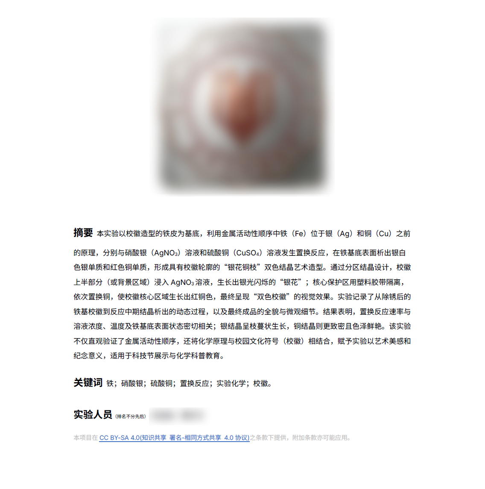

*封面来自其他小组作品*

本周，激动人心的科技节到来了，那么，我们化学也有机会进入实验室，做一些有关于金属置换的“小实验”。

我组一开始想要做党徽的，但是感觉不怎么恰当，于是做了校徽。

不难看出，我一开始是想发到`SHIT 期刊`上面的，奈何人才太多，不让发了。这个效果还是蛮好的。

那么，为什么是胡闹厨房呢？这就不得不提到我们的年级一堆神奇人物，非常的好啊也是！把温度计当玻璃棒搅拌用，把点火枪当酒精灯烧`Cu`玩焰色反应，还有把硫酸铜溶液不停置换`Fe`的。。。。

最终呢，显然实验室没有炸掉。好耶！！