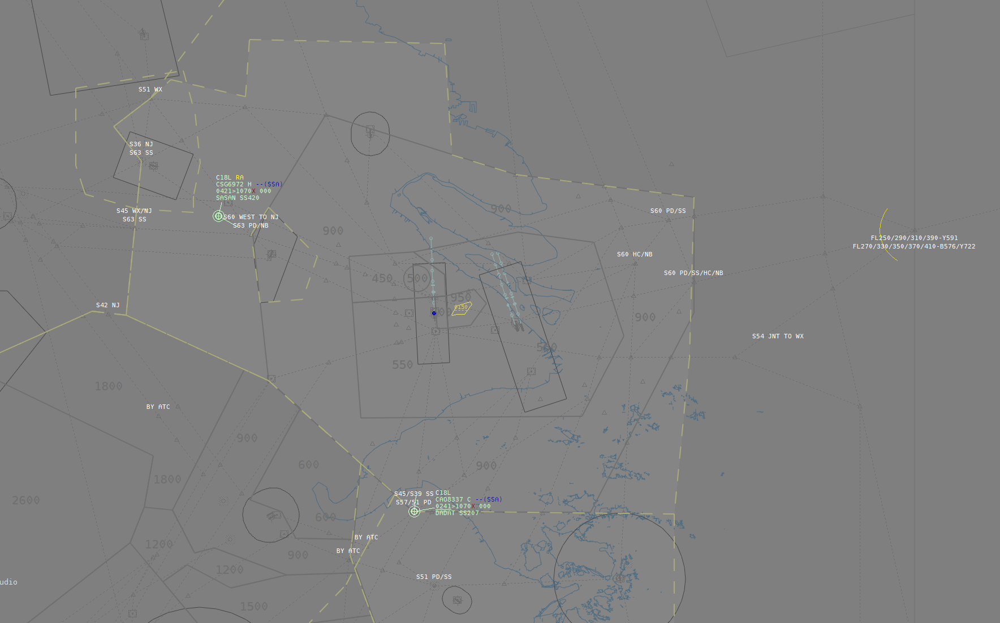

# 前言

本文大部分内容由：Gergely Csernak，制作，我负责对此进行本地化翻译处理，原版可见：[https://www.euroscope.hu/wp/scenario-file/](https://www.euroscope.hu/wp/scenario-file/)

## 文件

模拟机文本是纯文本文件。你可以用任何文本编辑器编辑，或者内置的 *[场景编辑器](https://www.euroscope.hu/wp/scenario-editor/)* ，或者使用Windows内置编辑器。文件是逐行处理的。这个文件里没有分区，你可以把每一行中间的空行删除。当然也有一些例外。我们将明确定义哪写内容应在另一内容之前。

## ILS/跑道定义

你可以为一个文本定义四个活跃跑道。它可以定义为ILS：

```
ILS<跑道名称>:<纬度>:<经度>:<跑道航向>
ILS<跑道名称>:<纬度>:<经度>:<另一端纬度>:<另一端纬度>
```

跑道名称会显示在菜单栏的四个按钮上。
跑道定义的两个不同例子：

```
ILS31R:N047.25.24.615:E019.17.35.260:310
ILS31R:47.4230787:19.2947038:47.4460265:19.2577522
```

自 EuroScope v3.2起，航向为浮点数。

## 等待定义

你可以按需定义等待。定义如下：

```
HOLDING:<点名称>:<入航角>:<方向>
```

其中*点名称*不仅是FIXS，也可以是扇区文件中的任意内容（VOR、NDB、FIX）。 *方向*可以是 `1` 表示右转，`-1` 表示左转。以下是一些例子：

```
HOLDING:AGMAS:310:1
HOLDING:MAMOS:130:-1
HOLDING:VEBOS:95:-1
HOLDING:TPS:160:-1
```

## 机场标高

这是一条定义示例：

```
AIRPORT_ALT:<高度>
```

举个例子：

```
AIRPORT_ALT:494.8
```

随着通过 Preair3d 塔台视角的引入，这一数值需要更精确。自 EuroScope v3.2 起，高度为浮点数。

## 管制员定义

模拟机中可以有无限数量的模拟管制员。它们也可以文本中配置：

```
CONTROLLER:<呼号>:<频率>
```

举个例子：

```
CONTROLLER:LHCC_CTR:133.2
CONTROLLER:LHBP_TWR:118.1
```

## 预设航路

*预设航路*是 EuroScope v3.2 的新功能。

你可以用它定义一些常用的盘旋、程序，这些航路可以让飞机在模拟机中遵循这些模式。然后你可以从列表中选择该航线，启动飞机沿此路线前进。

该航路是一串点的集合，每个点后附有可选的高度值。飞机会一个接一个地跟着点移动，试图达到该点定义的高度。比赛形式如下：

```
ROUTE:<航路名称>:<点[/高度]>[ <点[/高度]> ... ]
```

预设航路的典型用途如下：

- 复飞程序
- 盘旋
- 目视进近

```
ROUTE:Missed APP 31R:BP042/900 TPS/3000
ROUTE:Visual 31R:PUSTA HM/1000 R
```

## METAR报文

在模拟会话中使用 Prepar3d 塔台视图时，可以定义机场的气象条件。

只需定义一个标准且格式良好的 METARs。当你选择 METAR 按钮时，定义好的行会显示出来，但你仍然可以在发送前自由编辑 METAR 本身。METAR 的站点并不重要，因为定义以全局 METAR 数据发送给 FSX 或 P3D。

```
METAR:<METAR格式>
```

举几个例子：

```
METAR:LHBP 292000Z 21004KT 1500 +SN BKN015 02/02 Q1016 NOSIG
METAR:LHBP 292000Z 21004KT 6000 +RA BKN015 02/02 Q1016 NOSIG
METAR:LHBP 292000Z 21004KT CAVOK 02/02 Q1016 NOSIG
```

## 飞机位置

你可以为本次模拟机定义任意数量的飞机。要注意，飞机可能需要比控制它们更多的集中注意力。要定义飞机，应定义起始位置和高度：

```
@<应答机状态>:<呼号>:<应答机代码>:1:<纬度>:<经度>:<高度>:0:<航向>:0
```

Where 其中

- *应答机状态*可以是 `N` 表示普通模式，`S` 表示STBY
- *纬度*和*经度*可以是扇形文件中的格式，也可以是简单的格式
- 别忘了上面固定的`1`和`0`（它们只是出于某些技术原因存在）
- *航向*值有点复杂，使用请求的航向度数，并用以下公式决定这里的值：
  - `((int) ( Heading * 2.88 + 0.5 )) << 2 )`
  – 也可以是：`( Heading * 2.88 + 0.5 ) * 4`.
- 当*应答器*设置为 `0000` 时，模拟器会将其显示并当做为车辆。

示例：

```
@N:MAH661:2622:1:N048.10.38.498:E018.10.36.537:15000:0:0:0
@N:MAH1501:2632:1:46.793880004674:17.795807317989:17000:312:4192376:450
@N:AZA525:2606:1:N047.26.41.961:E019.15.29.777:550:0:0:0
```

## 飞行计划

每条飞机位置线都应遵循飞行计划线。不要将飞行计划和上面飞机位置的顺序写反，因为 EuroScope 只能保存有位置的飞机的飞行计划。飞行计划如下：

```
$FP<呼号>:*A:<飞行规则种类>:<飞行类型>:<真空速>:<出发机场>:<预计离场时间>:<实际离场时间>:<最终巡航高度>:<到达机场>:<航路飞行[小时]>:<航路飞行[分钟]>:<燃油时间[小时]>:<燃油时间[分钟]>:<备降机场>:<备注>:<航路>
```

其中*飞行计划类型*可以是 I 或 V 。

别忘了第二位的状态 `*A`。Gergely Csernak认为：这有一些别的含义吧。。。

示例：

```
$FPMAH661:*A:I:B736:370:EHAM:1720:1720:390:LHBP:1:40:2:23:LOWW:/V/:ARNEM UL620 BIRKA UZ21 OMELO UL620 KOPIT UM748 RUTOL
$FPMAH1501:*A:I:B738:430:GCTS:1730:1730:340:LHBP:1:20:2:0:LOWW:/V/:KORAL UG5 ESS UN871 VJF UN851 MHN UM603 ALG UL5 VALMA UL865 ANC UM986 KOPRY UY53 VEBOS
$FPAZA525:*A:I:MD87:430:LHBP:1730:1730:360:LIMC:1:20:2:0:LIRF:/V/:BAKOT UY52 SUNIS Q114 GRZ UP976 DETSA UM984 LUSIL
```

## 模拟机航路

从 EuroScope v3.2 起，模拟机航路的是可选的。如果未指定，则从飞行计划中提取航路和当前位置。但使用以下内容时，他会将默认值覆盖。

它必须在位置的那一行之后。航路是飞机应遵循的路线逐点列表。它不应包含任何除了航点之外的其他信息，仅包含航路点列表和可选的带斜线分隔符的高度值。

仍有两种方式定义这条路线：

- *使用呼号* —— 在这种情况下，你仍然可以使用一些可选参数。它们现在已过时，因为所有这些都可以单独成行输入。
- *无呼号* —— 此时只能定义带有高度值的航线。

```
$ROUTE:<呼号>:<包括高度的点>[:<开始>][:<飞行员最小响应时间>][:<飞行员最大响应时间>][:<下高的点>:<下到的高度>]
$ROUTE:<由航点构成的航路>
```

这里的*开始*值是等待时间，几分钟后飞机将被加入模拟。这是一个可选参数。如果省略了会用 `0`，那就意味着立即加入。延迟仅基于模拟时间计算。当整个模拟机暂停时，延迟时间不会被进一步倒计时。

*飞行员的最小**和最大响应时间*决定了飞行员响应命令的速度。你在模拟中下达的每一个命令，飞机都会响应并开始在最小值和最大值之间随机秒数内跟随。

最小时间在 1 到 30 秒之间，最大时间在 2 到 31 秒之间。如果省略这些参数，则将使用现实管制员测量的平均响应时间为最小 12 秒，最多 17 秒。

下降*至航点*和下降*至高度*参数用于为飞机的到来设定初始下降。这让教员的工作更轻松，因为初始数值不应为每个飞机设定。具有指定值的飞机下降到该点的高度。

从 EuroScope v3.2 开始，航线可能包含可选的高度值。它们的工作方式与*预定义路线*部分完全相同。要小心，因为即使没有教员指令，飞机也会遵循这里定义的高度值。

示例：

```
$ROUTE:MAH661:RUTOL/19000 BP523 MAMOS BP522 BP521 BP520 BP519 BP518 BP512 BP416 BP415 BP414 BP413 BP049
$ROUTE:MAH663:RUTOL BP523 MAMOS BP522 BP521 BP520 BP519 BP518 BP512 BP416 BP415 BP414 BP413 BP049:10:5:10:RUTOL:19000
$ROUTE:MAH1501:VEBOS/17000 BP421 BP420 BP419 BP418 BP417 BP416 BP415 BP414 BP413 BP049:0:15:20
$ROUTE:AZA525:BP713 MNR BP612 BP610 BP614 BAKOT SIRDU SUNIS:10:5:10
```

请注意：MAH661 和 MAH663 都将通过 RUTOL 下降至 FL190。

您也可以将 ROUTE 行拆分为多行。可以省略呼号，并将该行末尾的所有参数移至后续行中。

```
$ROUTE:ABONY AGMAS BP539 TPS BP538 BP537 BP536
START:2
DELAY:2:5
REQALT:ABONY:12000
```

你可以在路线部分输入两个特殊词：

- FP — 这和空的一样。在这种情况下，EuroScope 基于飞行计划路线构建航线数据，不受高度限制。
- FPA – 除了将COPX航线的所有高度限制数据添加到航路字符串中，其他方面与之前相同。

## 附加数据

自 EuroScope v3.2 起，新增参数，你可以为飞机指定：

- `IASVARIA`——飞机应偏离正常 IAS 多少。它可能在 `0` 到 `20` 之间。
- `INITIALPSEUDOPILOT`——这条线定义了谁将成为飞机的控制员，也就是教员。如果呼号正在登录，控制权会立即转移给该管制员。
- `SIMDATA` – 它为塔台视角和地面模拟确定了一些额外的数据。

示例：

```
INITIALPSEUDOPILOT:<callsign>
INITIALPSEUDOPILOT:ACCHU06
SIMDATA:<callsign>:<plane type>:<livery>:<maximum taxi speed>:<taxiway usage>:<object extent>:<ground alt>
```

其中：

- *飞机类型* — 可以是：
  - `*` 使用飞行计划中的那个，
  - 还有另一种可以覆盖它的类型。这种类型的飞机应可在 P3D 模拟对象中提供。在这里，你还可以在模拟器中设置 ·aircraft.cfg· *的标题字段* ，以显示其他车辆，如“引导车”。你还必须用[VHCL]后缀来设置呼号。
- *涂装* ——可以是：
  - `*` 使用呼号的前三个字母，
  - 还有另一种可以覆盖它的类型。这种涂装应该可以在 P3D 模拟对象中提供。
- *最大滑行速度* ——当你模拟其他类型的地面车辆时，你可能希望定义它们的最大滑行速度。数值可以在 `5` 到 `200` 之间。
- *滑行道使用* ——它决定车辆可以使用哪些滑行道。当你想模拟除飞机外的其他地面载具时，它非常有用。请参阅 *[ESE 文件描述](https://www.euroscope.hu/wp/ese-files-description/)*中的滑行道定义。如果车辆滑行道使用值且位数与滑行道使用值为 0，则该车辆未使用滑行道。
- *物体范围* ——车辆的大小。该值用于检测地面碰撞。设置为 0 以禁用此功能。
- *地面高度* ——这里你可以定义飞机应该多高才能在 P3D 中看起来更好。保持 0 用于表示在地面。

```
SIMDATA:MAH782:B737:MAH:25:3:0.010
```

# 自制文本



## 运行提示

ZSSS，向南运行，DEP: 18R, ARR: 18L。

普通版本：起飞5分钟一架、AND进港4~5分钟不定、SASAN进港4分钟

进阶版本：起飞保持不变、AND进港3~4分钟压缩间隔、SASAN进港1.5~5分钟

进阶版主要考验：长距离下的雷达扫视能力、注意力的分配、优先级的处理

## 下载

[ZSSS_W_APP - Normal](https://raw.githubusercontent.com/supermastergui/supermastergui.github.io/refs/heads/master/content/post/scenario/Sweatbox/ZSSS_W_APP-Normal.txt)

[ZSSS_W_APP - Advanced](https://raw.githubusercontent.com/supermastergui/supermastergui.github.io/refs/heads/master/content/post/scenario/Sweatbox/ZSSS_W_APP-Advanced.txt)

## 示例


