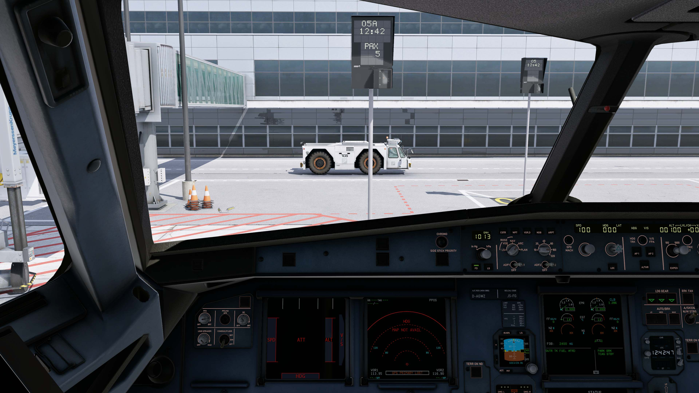

*封面来自 `X-Plane 12\Resources\bitmaps\backgrounds\default.png`*

# 前言

在开始前，确保你的X-plane不装任何插件和使用默认C172机模，可以达到FPS 60+的水平，不然在加了这些插件后，你的帧率会至少-20。当你的FPS低于20时，会由于[一些原因](https://www.x-plane.com/kb/the-simulators-measurement-of-time-is-slow/)，使得你的XP无法在真实倍速下运行，Swift或Xpilot将自动断线。

使用之前，确保你有能力可以在Google上搜索这些插件的名字，找到下载链接下载。

## BetterPushback

BetterPushback，是XP玩家都知道的一款经典推车插件。

不一样的：你可以在网上找到不同的语音包，改进真实感。

## X-RAAS2

X-RAAS2，是一款跑到咨询系统，每当进跑道的时候会叫“RUNWAY XX”，“APPROACHING RUNWAY XX”，据说真实的飞机也会有这套系统，~~虽然我不怎么信，但是还是有必要装一装~~

注意XP12要使用别人制作的新版本插件，用旧版本会导致报告错误。

## AviTab

AviTab，一款小平板插件，虽然这个插件我个人觉得不怎么好用。但，不装的话Toliss的平板上总是黑的，看起来不怎么舒服。

## AutoDGS

AutoDGS，一款适用于所有默认机场地景的廊桥停靠插件，



*图片来自：[hotbso/AutoDGS](https://github.com/hotbso/AutoDGS/blob/main/images/boarding.jpg)*

## ApronXP

ApronXP，是一款可以下机行走的插件，通过在设置中绑健（推荐是`X`），然后下机进行行走，非常值得推荐。

## XPlane Map Enhancement

XPlane Map Enhancement，可以让XP的默认地景贴图使用更新的卫星图进行替换，感觉我每次飞的都是夜航，没什么用，只有寒暑假可能有机会用用。

## FlyWithLua

FlyWithLua，许多插件的脚本，通过对XP使用Lua语言的支持，让其更加的灵活，接下来的许多插件都基于此。

然而，不知道为什么，我的FlyWithLua总是加载不进XP里面。

### LandingRate

相比过时的XGS，LandingRate更加的先进，然后可能更，新一点？

### Simple_Ground_Equipment_and_Services（SGES）

一款全面的地面设施服务插件，看样子非常好。

# 结言

除此之外，我每次进入XP都会提示我的8086端口不可用，我每次都用Powersell，扫了下占用端口的软件，然后发现：没有？？？

但，说是奇怪，在我编写本文的时候，这个提示又没有了。

我的组合：

- Volanta
- vAMSYS Pegasus
- Swift

```log
for X-Plane 12.4.0-r2-9b69b91a (build 124009 Intel 64-bit, Vulkan e0d7f10aef70fd7c5a579994fcf1df219059f06a)
Windows 10.0 (build 26200/2)
This is a 64-bit version of Windows.
CPU type: 13th Gen Intel Core i5-13500H - Speed: 2.8-3.2 GHz - Cores: 16
          Microcode 0x410e
Physical Memory (total for computer): 16961822720
Maximum Virtual Memory (for X-Plane only): 140737488224256

Vulkan Device       : NVIDIA GeForce RTX 4050 Laptop GPU (f61e100000)
Vulkan Version      : 1.4.312
Vulkan Driver       : 581.8.0
```

让我们，下周再见👋！

我会尽量保持每周写一篇记录的！